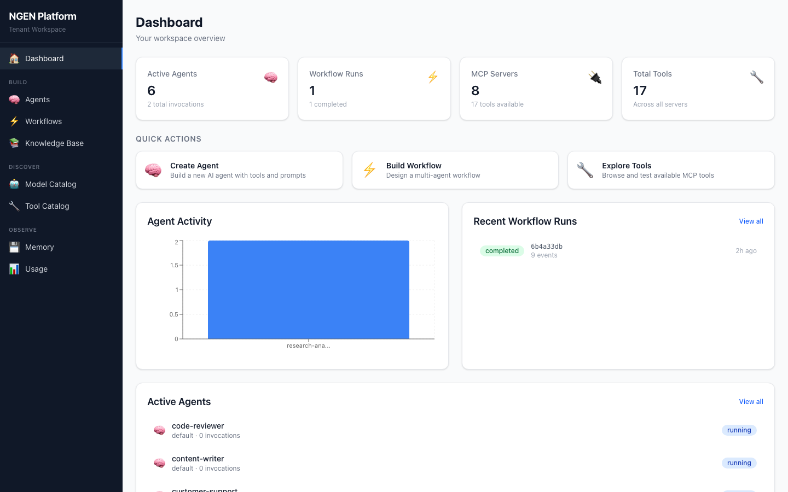
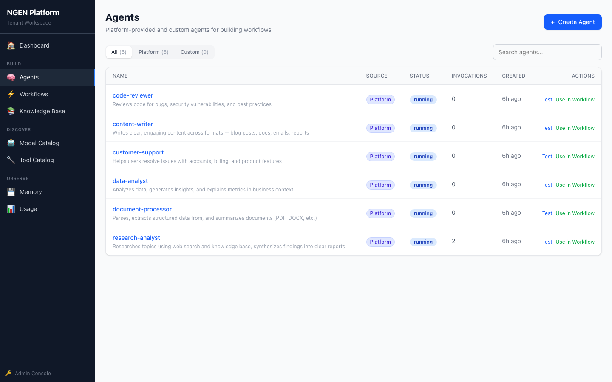
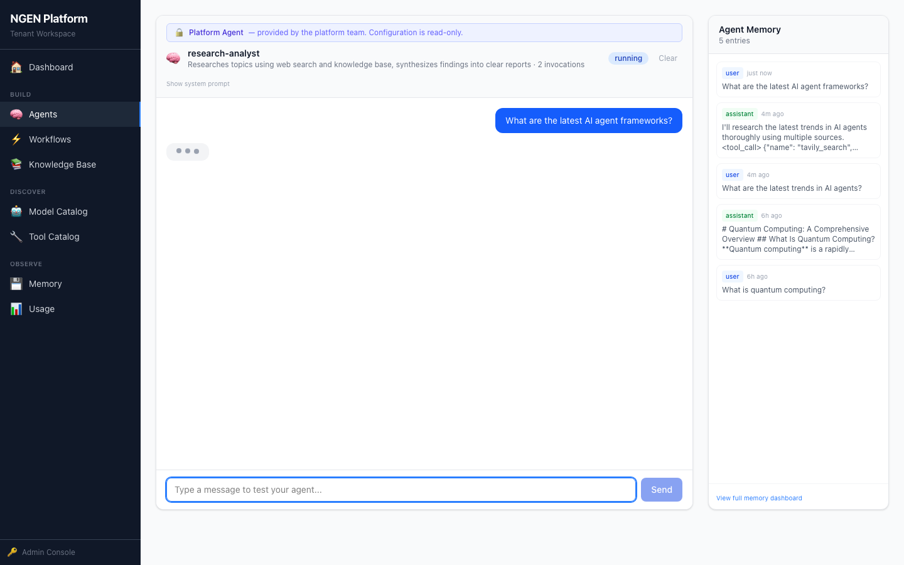
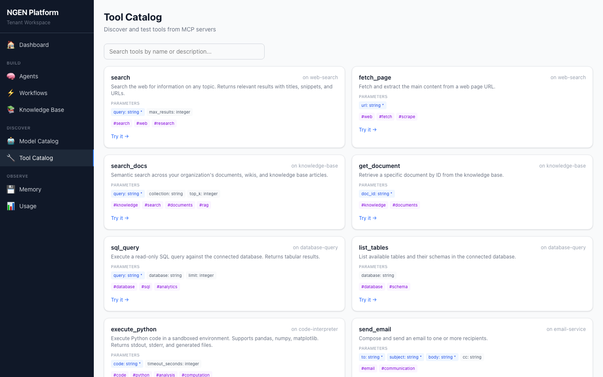
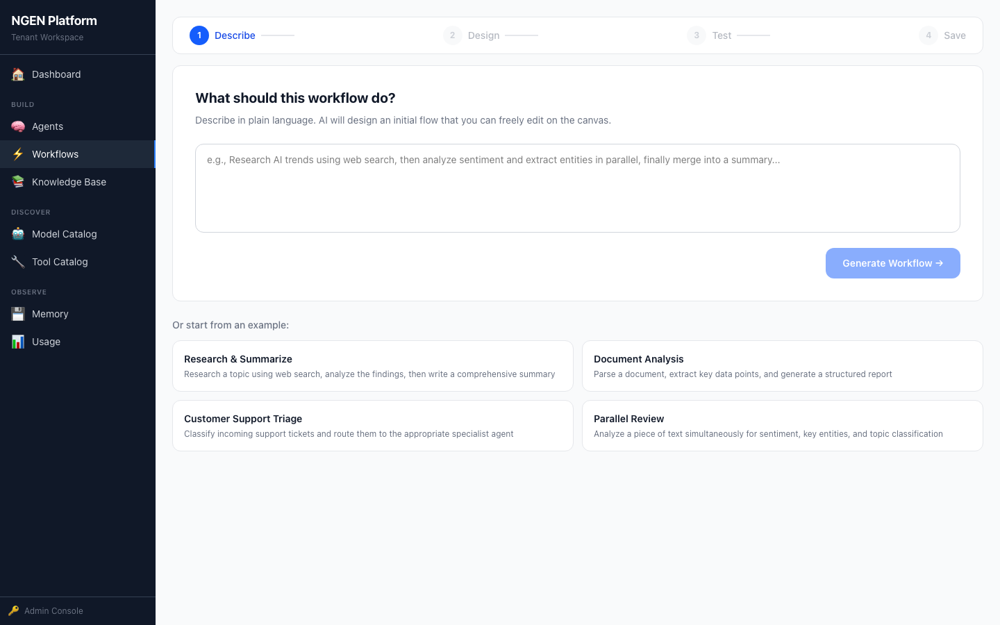
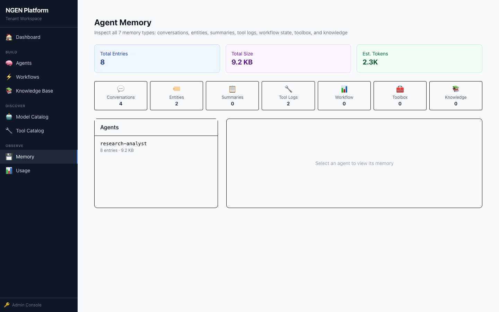

# NGEN Platform

**Multi-tenant, multi-agent orchestration platform for building, testing, and deploying AI agent workflows at scale.**

NGEN Platform provides a complete infrastructure for organizations to create AI agents, compose them into workflows, equip them with tools, and manage memory, governance, and cost — all with strict tenant isolation.

---

## Key Features

### Agent Management
- **Platform-shared agents** — curated, production-tested agents (research analyst, customer support, data analyst, content writer, document processor, code reviewer) available to all tenants
- **Custom tenant agents** — tenants create their own agents with custom system prompts and tools
- **Agent Test Bench** — interactive chat interface for testing agents with real tool calls and LLM responses
- **7-type memory system** — conversational, entity extraction, summarization, tool logs, workflow state, toolbox registry, and knowledge base

### Workflow Orchestration
- **Free-form canvas editor** — drag-and-drop nodes, draw edges, mix topologies (sequential, parallel, graph, hierarchical) in a single workflow
- **AI-assisted generation** — describe what you want in natural language, get a complete workflow with agents, edges, and YAML
- **Real-time execution** — SSE streaming of agent events during workflow runs
- **Human-in-the-loop** — approval gates for sensitive workflow steps

### Tool Ecosystem (MCP)
- **Built-in tools** — web search (DuckDuckGo), knowledge base (vector search), document intelligence (Landing.ai ADE parse/split/extract)
- **Tool catalog** — browse, search, and "Try it" directly from the UI
- **MCP protocol** — JSON-RPC 2.0 transport for external tool servers
- **Tenant-scoped tools** — architecture supports tenants bringing their own MCP servers

### Agentic RAG
- **Document upload** — PDF, DOCX, Markdown, TXT with automatic parsing and chunking
- **Vector search** — embedding-based semantic search over uploaded documents
- **Tenant-scoped collections** — documents isolated per tenant with platform docs shared globally
- **Document Intelligence** — Landing.ai ADE integration for structured data extraction

### Multi-Tenant Isolation
- **Tenant-scoped agents, memory, documents, and workflows** — strict isolation at every layer
- **Platform vs. tenant separation** — platform team manages models, tools, governance; tenants build and deploy
- **RBAC enforcement** — platform agents are read-only for tenants, no cross-tenant data leakage

### Governance & Observability
- **Budget policies** — daily/monthly cost limits per namespace
- **Rate limiting** — configurable request throttling
- **Usage metering** — per-tenant cost tracking and analytics
- **Memory observatory** — inspect memory consumption by agent, type, and tenant

---

## Screenshots

| Dashboard | Platform Agents |
|:-:|:-:|
|  |  |

| Agent Test Bench | Tool Catalog |
|:-:|:-:|
|  |  |

| Workflow Builder | Memory Observatory |
|:-:|:-:|
|  |  |

---

## Architecture

```
                    ┌─────────────────────────────────┐
                    │         Portal (React)           │
                    │     localhost:3000                │
                    └──────────┬──────────────────────-┘
                               │
              ┌────────────────┼────────────────┐
              │                │                │
    ┌─────────▼──────┐ ┌──────▼───────┐ ┌──────▼───────┐
    │  Workflow       │ │ Model        │ │ MCP          │
    │  Engine :8003   │ │ Gateway :8002│ │ Manager :8005│
    │                 │ │              │ │              │
    │ - Agents        │ │ - LLM routing│ │ - Tool catalog│
    │ - Workflows     │ │ - Cost track │ │ - Invocation  │
    │ - Memory (7)    │ │ - Multi-model│ │ - Built-in    │
    │ - Platform seed │ │              │ │   handlers    │
    └────────┬────────┘ └──────────────┘ └──────────────┘
             │
    ┌────────▼────────────────────────────────────────┐
    │                  NATS (JetStream)                │
    │            Event-driven messaging :4222          │
    └─────────────────────────────────────────────────-┘
             │
    ┌────────┼──────────┬──────────────┬───────────────┐
    │        │          │              │               │
┌───▼──┐ ┌──▼───┐ ┌────▼────┐ ┌──────▼──────┐ ┌──────▼──────┐
│Tenant│ │Model │ │Governance│ │  Metering   │ │ Onboarding  │
│:8000 │ │Reg   │ │  :8004   │ │   :8007     │ │   :8006     │
│      │ │:8001 │ │          │ │             │ │             │
└──────┘ └──────┘ └──────────┘ └─────────────┘ └─────────────┘
```

---

## Tech Stack

| Layer | Technology |
|-------|-----------|
| **Frontend** | React 19, TypeScript, Vite, Tailwind CSS 4, React Flow, Recharts |
| **Backend** | Python 3.11+, FastAPI, SQLAlchemy, asyncpg |
| **Messaging** | NATS with JetStream |
| **Database** | PostgreSQL 16 |
| **Cache** | Redis |
| **LLM** | Multi-provider via Model Gateway (Anthropic, OpenAI, etc.) |
| **Tools** | MCP (Model Context Protocol) JSON-RPC 2.0 |
| **Containers** | Docker Compose |
| **Testing** | Pytest (800+ tests, zero mocks, Testcontainers for Redis) |

---

## Quick Start

### Prerequisites
- Docker & Docker Compose
- Node.js 18+ (for portal development)
- Python 3.11+ with [uv](https://docs.astral.sh/uv/)

### 1. Clone and start infrastructure

```bash
git clone git@github.com:nbalawat/ngen-platform.git
cd ngen-platform
make install
```

### 2. Start all services

```bash
cd infrastructure/docker-compose
docker compose up -d
```

### 3. Open the portal

```
http://localhost:3000
```

You'll see the tenant dashboard with platform-provided agents ready to use.

### 4. Try it out

- **Agents** — 6 platform agents pre-loaded. Click "Test" on `research-analyst` and ask it a question — it will search the web and knowledge base, then respond with real AI.
- **Workflows** — Click "New Workflow", describe what you want (e.g., "Research a topic, analyze findings, write a report"), and the AI generates a complete workflow.
- **Tools** — Browse the Tool Catalog, click "Try it" on `web-search/search` with a query to see real results.
- **Knowledge Base** — Upload documents (PDF, DOCX, TXT) and search them semantically.

---

## Project Structure

```
ngen-platform/
├── portal/                     # React frontend (Vite + Tailwind)
├── services/
│   ├── workflow-engine/        # Agent lifecycle, workflow execution, memory
│   ├── model-gateway/          # LLM routing and cost tracking
│   ├── model-registry/         # Model catalog and versioning
│   ├── mcp-manager/            # Tool catalog, invocation, document pipeline
│   ├── tenant-service/         # Org/team/project management
│   ├── governance-service/     # Policy enforcement and budgets
│   ├── metering-service/       # Usage aggregation
│   └── onboarding-agent/       # Tenant onboarding automation
├── libs/
│   ├── ngen-framework-core/    # Agent executor, memory, CRD parser
│   ├── ngen-common/            # Shared auth, CORS, events, observability
│   ├── ngen-sdk/               # Client SDK
│   └── ngen-mock-llm/          # Mock LLM for testing
├── adapters/                   # Framework adapters (LangGraph, CrewAI, etc.)
├── infrastructure/             # Docker Compose configs
├── schemas/                    # Data schemas and CRD definitions
└── tests/                      # Integration tests
```

---

## Development

### Run tests

```bash
# All tests
make test

# Specific service
cd services/workflow-engine
python -m pytest tests/ -v

# MCP Manager (includes tool handler tests)
cd services/mcp-manager
python -m pytest tests/ -v
```

### Lint and type check

```bash
make lint
make typecheck
```

### Portal development

```bash
cd portal
npm install
npm run dev    # http://localhost:5173
```

---

## Platform vs. Tenant Responsibilities

| Responsibility | Platform Team | Tenant |
|---------------|:---:|:---:|
| Register LLM models | Yes | - |
| Register MCP tool servers | Yes | Phase 2 |
| Create platform agents | Yes | - |
| Create custom agents | - | Yes |
| Build workflows | - | Yes |
| Upload documents (RAG) | - | Yes |
| Set governance policies | Yes | - |
| Set budget limits | Yes | - |
| View usage/costs | Yes (all) | Yes (own) |
| Manage orgs/tenants | Yes | - |

---

## Memory System

Agents maintain 7 types of memory, all tenant-isolated:

| Type | Purpose | Trigger |
|------|---------|---------|
| **Conversational** | Chat history | Every user/assistant message |
| **Entity** | Extracted people, orgs, tech | Auto-extracted via LLM after invocation |
| **Summary** | Compressed conversations | Auto-generated after 20+ messages |
| **Tool Log** | Tool call audit trail | Auto-captured on every tool call |
| **Toolbox** | Registered tool inventory | Written on agent creation |
| **Workflow** | Execution state snapshots | Captured during workflow runs |
| **Knowledge Base** | Document embeddings | Document upload via RAG pipeline |

---

## API Overview

| Service | Port | Key Endpoints |
|---------|------|--------------|
| **Workflow Engine** | 8003 | `POST /agents`, `POST /agents/{name}/invoke`, `POST /workflows/run` |
| **Model Gateway** | 8002 | `POST /v1/chat/completions`, `GET /v1/models` |
| **MCP Manager** | 8005 | `GET /api/v1/tools`, `POST /api/v1/invoke`, `POST /api/v1/documents/upload` |
| **Tenant Service** | 8000 | `CRUD /api/v1/organizations`, `/teams`, `/projects` |
| **Governance** | 8004 | `CRUD /api/v1/policies`, `POST /api/v1/evaluate` |
| **Metering** | 8007 | `GET /api/v1/usage` |

---

## License

MIT
